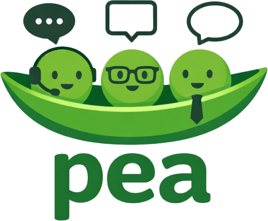

<div align="center">
  

  <p>
    <strong>Stakeholder simulation service for the Epic Systems Engineering Judgment Workshop</strong>
  </p>

  <p>
    
    
    
    
  </p>
</div>

---

`pea` stands for `Product Engineer Agents`.

It is the agent-side service for the Epic Systems Engineering Judgment
Workshop. The separate workshop app owns the learner experience; `pea` provides
the stakeholder simulations that learners talk to while they clarify ambiguous
requirements, surface constraints, and practice engineering judgment.

The workshop thesis is simple: as AI takes on more implementation work, the
scarce engineering skill becomes judgment. `pea` exists to help train that
skill.

## What Pea Does

`pea` simulates messy real-world stakeholders in structured exercises. These
agents can act like:

- product managers
- executives
- support and operations teams
- users
- regulators
- other engineers

The point is not to help participants write code. The point is to create the
kind of ambiguity, friction, and conflicting incentives that force participants
to ask better questions before anything gets built.

## What Pea Is Not

`pea` is not:

- a prompt engineering workshop
- an AI coding tutor
- a framework training project
- the primary workshop application

The learner-facing workshop app already exists. `pea` is the service that app
uses to run stakeholder conversations, and it will also provide instructor/admin
controls for managing agents, scenarios, and prompts.

## Quick Start

```bash
bun install
bun run dev
```

See [`docs/getting-started.md`](./docs/getting-started.md) for local setup and
environment details.

## Core Exercise Loop

Each scenario is meant to drive a critique loop:

1. Present an ambiguous situation.
2. Let participants ask clarification questions.
3. Require them to define the problem, constraints, assumptions, risks, and
   success criteria.
4. Reveal an implementation or proposed solution.
5. Critique the gap between intent and outcome.
6. Extract heuristics that improve future judgment.

Learning happens through repeated critique cycles, not lectures.

## Simulation Principles

Stakeholder agents should:

- reveal information progressively instead of dumping requirements
- speak like stakeholders, not like system design interviewers
- have incomplete knowledge
- sometimes contradict themselves or introduce new constraints late
- surface hidden tradeoffs only when participants ask the right questions

Good exercises force participants to uncover missing requirements, conflicting
incentives, rollout risks, UX concerns, and vague success criteria.

## System Role

At a high level, `pea` is responsible for:

- stakeholder conversation runtime
- scenario and agent behavior configuration
- instructor/admin controls for prompts and simulations
- service endpoints the workshop app can call or embed

The workshop app remains responsible for cohort flow, learner UX, facilitation,
and the broader curriculum experience.

## Current Foundation

The current codebase is built on:

| Layer           | Technology                                                            |
| --------------- | --------------------------------------------------------------------- |
| Runtime         | [Cloudflare Workers](https://workers.cloudflare.com/)                 |
| Web stack       | [Remix 3](https://remix.run/) (alpha)                                 |
| Package manager | [Bun](https://bun.sh/)                                                |
| Database        | [Cloudflare D1](https://developers.cloudflare.com/d1/)                |
| Session/OAuth   | [Cloudflare KV](https://developers.cloudflare.com/kv/)                |
| Stateful agents | [Durable Objects](https://developers.cloudflare.com/durable-objects/) |
| Testing         | [Playwright](https://playwright.dev/)                                 |
| Bundling        | [esbuild](https://esbuild.github.io/)                                 |

## Documentation

| Document                                                           | Description                                      |
| ------------------------------------------------------------------ | ------------------------------------------------ |
| [`docs/product-overview.md`](./docs/product-overview.md)           | Purpose, scope, and workshop framing             |
| [`docs/roadmap.md`](./docs/roadmap.md)                             | High-level project phases and priorities         |
| [`docs/getting-started.md`](./docs/getting-started.md)             | Local setup and development commands             |
| [`docs/architecture/index.md`](./docs/architecture/index.md)       | Runtime architecture and system boundaries       |
| [`docs/environment-variables.md`](./docs/environment-variables.md) | Environment variable guidance                    |
| [`docs/cloudflare-offerings.md`](./docs/cloudflare-offerings.md)   | Optional Cloudflare integrations                 |
| [`docs/agents/setup.md`](./docs/agents/setup.md)                   | Local development and verification expectations  |

---

<div align="center">
  <sub>Built with ❤️ by <a href="https://epicweb.dev">Epic Web</a></sub>
</div>
